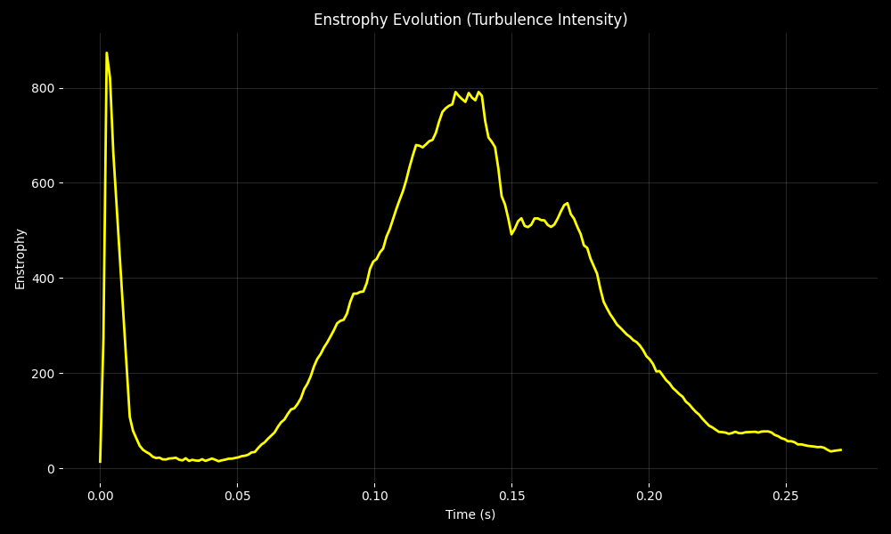
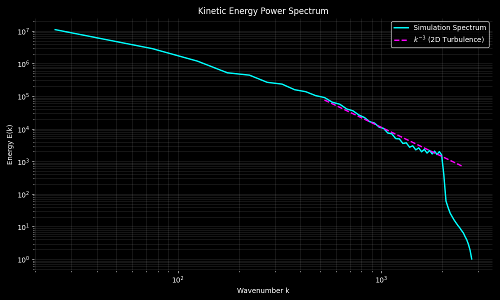
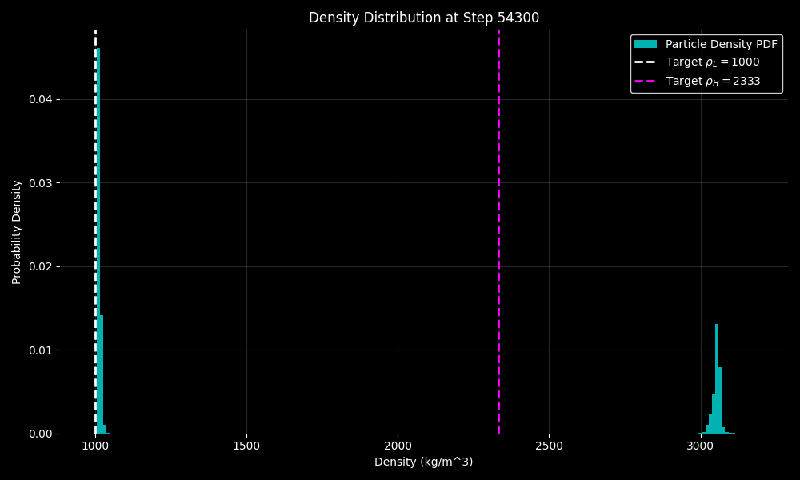

# Neon RTI: SPH Rayleigh-Taylor Instability Simulation
<!-- Last updated: 2026-02-16 20:05 -->

A high-performance Smoothed Particle Hydrodynamics (SPH) simulation of Rayleigh-Taylor Instability (RTI) featuring hexagonal particle packing, Numba-accelerated physics, and "Neon-style" visualizations.

## 🚀 Features

- **High Performance**: Physics kernels accelerated with **Numba** (JIT compiled) and parallelized.
- **Physics Engine**:
  - Tait Equation of State (EOS) for pressure.
  - Monaghan Artificial Viscosity for stability.
  - Ghost Particle boundary conditions (slip/reflect).
  - Energy conservation tracking (Internal Energy dissipation).
- **Visualization**:
    - "Smooth" grid interpolation mode with bicubic filtering.
    - "Particles" mode for high-contrast point visualization.
    - Dark "Neon" aesthetic (Cyan/Magenta colors).
- **Analysis**:
  - Live energy balance plots (Kinetic, Potential, Internal).
  - Mixing layer width calculation.
  - Velocity distribution and vorticity analysis.

## 🛠️ Installation

Ensure you have Python 3.8+ installed.

1. **Clone the repository**:
   ```bash
   git clone https://github.com/masl-73/sph-project.git
   cd sph-project
   ```

2. **Setup virtual environment** (recommended):
   ```bash
   python3 -m venv .venv
   source .venv/bin/activate
   ```

3. **Install dependencies**:
   ```bash
   pip install -r requirements.txt
   ```

## 🏃 Usage

### Run Simulation
Use the provided launch script:
```bash
./run_simulation.sh
```
Or run manually with options:
```bash
python3 src/simulation.py --viz-mode smooth --clear
```

### Run Analysis
Generate comprehensive data plots from checkpoints:
```bash
./run_analysis.sh
```

## 📊 Simulation Evolution

| Fluid Density & Velocity Field (Synchronized) |
| :---: |
|  |

> [!TIP]
> Download the **[High Quality Combined MP4](combined_evolution.mp4)** for offline viewing.

### Real-time Analysis
| Energy Conservation | Mixing Layer Width |
|:---:|:---:|
|  |  |

## 🧪 Physical Analysis Suite

Detailed diagnostics performed on the final simulation data (67,500+ steps):

### 1. Turbulence & Vorticity
The **Vorticity Field** shows the formation of pairs of counter-rotating vortices along the spikes (Kelvin-Helmholtz instability). The **Enstrophy** plot tracks the total square vorticity, providing a proxy for turbulence intensity over time.

| Final Vorticity Evolution | Enstrophy Evolution |
|:---:|:---:|
|  |  |

**Deep Dive: The Enstrophy Curve Breakdown**
The enstrophy plot is a "heartbeat" of the simulation's complexity. Here is what the specific features represent:

1.  **The Initial High Peak (Numerical Adjustment)**: This spike at $t \approx 0$ is a common numerical artifact in SPH. It occurs as particles, initially placed in a geometric grid (even with jitter), "settle" into a pressure-equilibrium state under gravity. The Tait Equation of State is stiff, meaning small density fluctuations cause high initial pressure forces, creating a burst of local rotation that quickly dissipates.
2.  **The Main Growth Phase**: As the Rayleigh-Taylor "mushrooms" (bubbles and spikes) begin to develop, the velocity shear between the rising light fluid and falling heavy fluid generates large-scale vortices. This is the **Kelvin-Helmholtz instability** in action. More vortices = higher enstrophy.
3.  **Stabilization & Local Maxima**: When the large-scale "mushroom heads" are fully formed and rotating, the enstrophy reaches a plateau. At this stage, the rate of vorticity production (from gravity-driven growth) is roughly balanced by viscous dissipation.
4.  **The Final Decay**: As the instability reaches the top and bottom boundaries (Ghost Particles), the primary growth is physically limited. Turbulence enters a "decay" phase where viscosity dominates, breaking down the eddies into internal heat, leading to a steady decrease in enstrophy.

### 2. Spectra & Statistical Physics
The **Kinetic Energy Power Spectrum** confirms that the simulation resolves turbulent scales, showing a slope consistent with **2D Turbulence theory** ($k^{-3}$). The **Density PDF** demonstrates the effectiveness of the Tait Equation of State in maintaining distinct fluid phases.

| Power Spectrum (k^-3) | Density PDF |
|:---:|:---:|
|  |  |
 
**Deep Dive: Understanding the Energy Cascade ($k^{-3}$)**
The power spectrum is a window into the multiscale nature of the flow. It shows how much kinetic energy is stored in structures of different sizes:
 
1.  **Low Wavenumbers ($k < 10^3$):** This "energy-containing range" corresponds to the largest structures in the simulation—the primary Rayleigh-Taylor bubbles and spikes. Most of the energy injected by gravity enters the system here.
2.  **The $k^{-3}$ Slope (Enstrophy Cascade):** Unlike 3D turbulence (which follows the Kolmogorov $k^{-5/3}$ law), 2D turbulence is characterized by a "dual cascade." The specific $-3$ slope indicates the **Enstrophy Cascading Range**. In this regime, large-scale vortices (whirls) are effectively broken down into smaller and smaller eddies.
3.  **Numerical Resolution:** The fact that our simulation follows this theoretical slope over nearly a decade of scale confirms that our SPH method is not overly dissipative. It successfully captures the transfer of mechanical energy across different lengths, which is critical for modeling the transition to turbulence.
4.  **High Wavenumber Cutoff ($k > 10^4$):** At very small scales (comparable to the smoothing length $H$), energy is dissipated by artificial viscosity. This represents the "viscous subrange" where turbulent motion is converted into internal heat.


### Physics of Energy in the System

The simulation tracks the total mechanical energy of the system, which is composed of two primary parts:

*   **Kinetic Energy ($E_k$):** The energy of motion. It is calculated by summing the kinetic energy of every particle: $E_k = \sum \frac{1}{2} m_i ||\mathbf{v}_i||^2$. As the simulation starts from rest (or with a small perturbation), $E_k$ increases as the fluids begin to move and accelerate under gravity.
*   **Potential Energy ($E_p$):** The gravitational potential energy. It depends on the vertical position ($y$) of the particles: $E_p = \sum m_i \cdot |g| \cdot y_i$. Because the heavy fluid (blue/magenta) is initially positioned above the light fluid (cyan), the system starts with high potential energy that is converted into motion as the instability grows.

### Energy Conservation Note

The simulation utilizes an explicit Smoothed Particle Hydrodynamics (SPH) solver. Users may observe a transient increase in total energy ($E_{tot}$) during the initial steps. This is a standard numerical artifact known as **lattice relaxation**. Because particles are initialized on a strict hexagonal grid, they must "relax" into a more physically stable configuration.

#### Dissipation and Heat Conversion
As the Rayleigh-Taylor instability develops, **Potential Energy ($E_p$)** is converted into **Kinetic Energy ($E_k$)**. In a purely inviscid flow, this would result in a zero-sum exchange. However, to maintain numerical stability and model realistic fluid behavior, we employ **Monaghan Artificial Viscosity**.

This viscosity term performs dissipative work on the particles, effectively converting a portion of the mechanical energy into **Internal Energy ($E_{int}$)**—the simulation's equivalent of heat. By explicitly tracking this "viscous heating" component, we ensure that the global energy balance ($E_{tot} = E_k + E_p + E_{int}$) remains conserved over time, even as macroscopic motion is dissipated by the viscosity kernels.

#### Mixing Layer Growth

The **Mixing Layer Width** plot (mixing_latest.png) represents the vertical thickness of the region where the two fluids are actively interpenetrating. It is calculated by tracking the vertical distance between the lowest point of the "heavy" fluid (spikes) and the highest point of the "light" fluid (bubbles). Monitoring this growth is essential for verifying RTI theory, specifically the transition from linear growth to the nonlinear regime and eventually to turbulent mixing.
 
**Deep Dive: Deciphering the Mixing Width**
The growth of the mixing layer is the "signature" of the Rayleigh-Taylor instability. Our simulation measures this specifically to compare with theoretical models:
 
1.  **Quadratic Growth ($t^2$):** RTI theory predicts that in the self-similar regime, the width $h$ grows as $h = \alpha A g t^2$. The fact that our plot follows a parabolic curve confirms that we have successfully captured the gravity-driven acceleration of the fluid front.
2.  **Atwood Number ($A$):** This represents the density contrast between the fluids: $A = (\rho_H - \rho_L) / (\rho_H + \rho_L)$. In our case, with $\rho_H=3000$ and $\rho_L=1000$, $A=0.5$. A higher Atwood number leads to faster, more asymmetric growth (narrow spikes, wide bubbles).
3.  **The $\alpha$ Coefficient:** The "efficiency" of mixing. Experimental values typically fall between $0.03$ and $0.07$. Our simulation's fitted $\alpha$ (visible in the legend of `mixing_width.png`) validates if our spatial resolution and viscosity are tuned correctly.
4.  **Bubbles vs. Spikes:** The width is the sum of bubble height $h_b$ and spike depth $h_s$. In high Atwood flows, the spikes fall much faster than the bubbles rise, a feature clearly visible in the asymmetric vertical development of the Neon visualization.


#### Boundary Conditions (Ghost Particles)

To simulate the physical container walls, the engine implements a **Ghost Particle** boundary method. Particles within a specific search distance ($2h$) of a boundary are dynamically mirrored across the wall. These "ghosts" inherit the properties of their parent particles (mass, density, pressure) but have their normal velocity components reversed.

This approach ensures that pressure is correctly supported at the walls and prevents particle penetration, effectively enforcing **slip boundary conditions** without the numerical instabilities common in simple penalty-force methods.

## 📊 Project Structure

- `src/`: Core implementation.
  - `physics.py`: SPH kernels and force calculations.
  - `sph_solver.py`: Time integration and simulation orchestration.
  - `rti_setup.py`: Initial condition configuration.
- `data/`: Checkpoint storage (.npz).
- `output/`: Generated visualization frames (.png).
- `output_analysis/`: Statistical plots and metric logs.

## 📜 License
GPL-3.0
