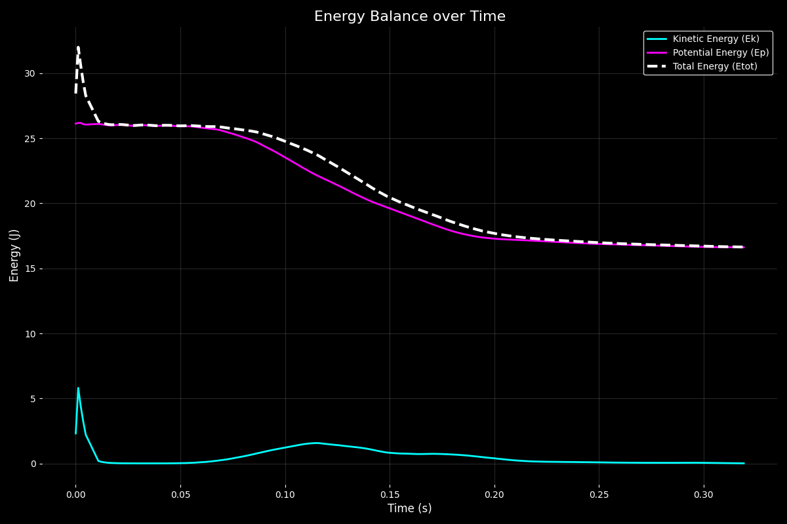
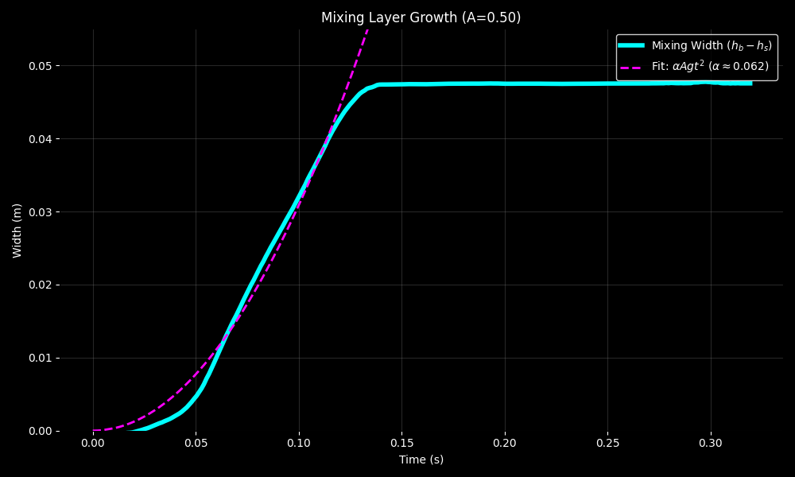

# Neon RTI: SPH Rayleigh-Taylor Instability Simulation

A high-performance Smoothed Particle Hydrodynamics (SPH) simulation of Rayleigh-Taylor Instability (RTI) featuring hexagonal particle packing, Numba-accelerated physics, and "Neon-style" visualizations.


## 🚀 Features

- **High Performance**: Physics kernels accelerated with **Numba** (JIT compiled) and parallelized.
- **Physics Engine**:
  - Tait Equation of State (EOS) for pressure.
  - Monaghan Artificial Viscosity for stability.
  - Ghost Particle boundary conditions (slip/reflect).
  - Energy conservation tracking (Internal Energy dissipation).
- **Visualization**:
    - "Smooth" grid interpolation mode with bicubic filtering.
    - "Particles" mode for high-contrast point visualization.
    - Dark "Neon" aesthetic (Cyan/Magenta colors).
- **Analysis**:
  - Live energy balance plots (Kinetic, Potential, Internal).
  - Mixing layer width calculation.
  - Velocity distribution and vorticity analysis.

## 🛠️ Installation

Ensure you have Python 3.8+ installed.

1. **Clone the repository**:
   ```bash
   git clone https://github.com/masl-73/sph-project.git
   cd sph-project
   ```

2. **Setup virtual environment** (recommended):
   ```bash
   python3 -m venv .venv
   source .venv/bin/activate
   ```

3. **Install dependencies**:
   ```bash
   pip install -r requirements.txt
   ```

## 🏃 Usage

### Run Simulation
Use the provided launch script:
```bash
./run_simulation.sh
```
Or run manually with options:
```bash
python3 src/simulation.py --viz-mode smooth --clear
```

### Run Analysis
Generate comprehensive data plots from checkpoints:
```bash
./run_analysis.sh
```

## 📊 Simulation Results

| Fluid Density | Velocity Field Evolution |
|:---:|:---:|
|  |  |

> [!TIP]
> Download the **[High Quality MP4 Version](velocity_evolution.mp4)** for offline viewing.

### Real-time Analysis
| Energy Conservation | Mixing Layer Width |
|:---:|:---:|
|  |  |

### Physics of Energy in the System

The simulation tracks the total mechanical energy of the system, which is composed of two primary parts:

*   **Kinetic Energy ($E_k$):** The energy of motion. It is calculated by summing the kinetic energy of every particle: $E_k = \sum \frac{1}{2} m_i ||\mathbf{v}_i||^2$. As the simulation starts from rest (or with a small perturbation), $E_k$ increases as the fluids begin to move and accelerate under gravity.
*   **Potential Energy ($E_p$):** The gravitational potential energy. It depends on the vertical position ($y$) of the particles: $E_p = \sum m_i \cdot |g| \cdot y_i$. Because the heavy fluid (blue/magenta) is initially positioned above the light fluid (cyan), the system starts with high potential energy that is converted into motion as the instability grows.

### Energy Conservation Note

The simulation utilizes an explicit Smoothed Particle Hydrodynamics (SPH) solver. Users may observe a transient increase in total energy ($E_{tot}$) during the initial steps. This is a standard numerical artifact known as **lattice relaxation**. Because particles are initialized on a strict hexagonal grid, they must "relax" into a more physically stable configuration.

#### Dissipation and Heat Conversion
As the Rayleigh-Taylor instability develops, **Potential Energy ($E_p$)** is converted into **Kinetic Energy ($E_k$)**. In a purely inviscid flow, this would result in a zero-sum exchange. However, to maintain numerical stability and model realistic fluid behavior, we employ **Monaghan Artificial Viscosity**.

This viscosity term performs dissipative work on the particles, effectively converting a portion of the mechanical energy into **Internal Energy ($E_{int}$)**—the simulation's equivalent of heat. By explicitly tracking this "viscous heating" component, we ensure that the global energy balance ($E_{tot} = E_k + E_p + E_{int}$) remains conserved over time, even as macroscopic motion is dissipated by the viscosity kernels.

#### Mixing Layer Growth

The **Mixing Layer Width** plot (mixing_latest.png) represents the vertical thickness of the region where the two fluids are actively interpenetrating. It is calculated by tracking the vertical distance between the lowest point of the "heavy" fluid (spikes) and the highest point of the "light" fluid (bubbles). Monitoring this growth is essential for verifying RTI theory, specifically the transition from linear growth to the nonlinear regime and eventually to turbulent mixing.

#### Boundary Conditions (Ghost Particles)

To simulate the physical container walls, the engine implements a **Ghost Particle** boundary method. Particles within a specific search distance ($2h$) of a boundary are dynamically mirrored across the wall. These "ghosts" inherit the properties of their parent particles (mass, density, pressure) but have their normal velocity components reversed.

This approach ensures that pressure is correctly supported at the walls and prevents particle penetration, effectively enforcing **slip boundary conditions** without the numerical instabilities common in simple penalty-force methods.

## 📊 Project Structure

- `src/`: Core implementation.
  - `physics.py`: SPH kernels and force calculations.
  - `sph_solver.py`: Time integration and simulation orchestration.
  - `rti_setup.py`: Initial condition configuration.
- `data/`: Checkpoint storage (.npz).
- `output/`: Generated visualization frames (.png).
- `output_analysis/`: Statistical plots and metric logs.

## 📜 License
GPL-3.0
